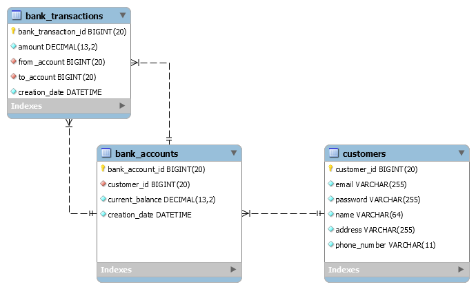

[![LinkedIn][linkedin-shield]][linkedin-url]

# Online Banking Service
A website for online banking service to manage transfer transaction in Java Servlet and JSP.

## Built With
* [Java](https://en.wikipedia.org/wiki/Java_(programming_language))
* [Jakarta Servlet & JSP](https://en.wikipedia.org/wiki/Jakarta_Servlet)
* [MySQL](https://www.mysql.com/)
* [HTML5 & CSS3]()

## ERD

  

<!-- CONTRIBUTING -->
## Contributing

Any contributions you make are **greatly appreciated**.

1. Fork the Project
2. Create your Feature Branch (`git checkout -b feature/AmazingFeature`)
3. Commit your Changes (`git commit -m 'Add some AmazingFeature'`)
4. Push to the Branch (`git push origin feature/AmazingFeature`)
5. Open a Pull Request

<!-- CONTACT -->
## Contact

Mahmoud Ahmed - [Twitter @1243Mahmoud](https://twitter.com/1243Mahmoud) - mahmoud_ahmed@stud.fci-cu.edu.eg

<!-- MARKDOWN LINKS & IMAGES -->
[license-shield]: https://img.shields.io/github/license/othneildrew/Best-README-Template.svg?style=flat-square
[linkedin-shield]: https://img.shields.io/badge/-LinkedIn-black.svg?style=flat-square&logo=linkedin&colorB=555
[linkedin-url]: https://www.linkedin.com/in/mahmoudaahmedd/
